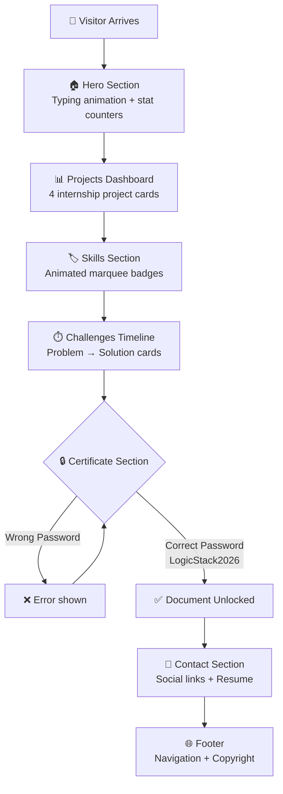

<div align="center">


<br/>


<br/>

[](#)
[](#)
[](#)
[](#)
[](#)
[](#)
[](#)
[](#)

[](#)
[](#)
[](#license)
[](#)
[](#)

</div>

<br/>

---

## 📌 Project Overview

This repository contains a **professional Data Analyst Portfolio Dashboard** — a modern, fully responsive single-page web application built to showcase a complete **[4-week Data Analyst Internship journey](https://github.com/YasirAwan4831) at Logic Stack** (June – July 2026).

This project serves two purposes simultaneously:

> 🎯 **Portfolio** — A recruiter-ready showcase of technical skills, completed projects and internship achievements.
>
> 📊 **Interactive Dashboard** — A structured, navigable internship dashboard where every week's work — SQL queries, Python EDA, Power BI dashboards and Excel analysis — is presented as a complete case study.

Rather than a simple list of links, this portfolio tells a story: from zero practical experience to delivering 4 production-quality data analysis projects in 4 weeks — each documented with objectives, tools, challenges, solutions and results.

---

## ✨ Features

| Feature | Description | Status |
|---|---|---|
| 🎨 **Animated Hero Section** | Typing SVG animation cycling through roles + animated stat counters | ✅ |
| 📊 **Projects Dashboard** | 4 internship project cards with GitHub, YouTube & LinkedIn links | ✅ |
| 🏷️ **Floating Skills Marquee** | Three rows of animated skill badges scrolling in alternating directions | ✅ |
| ⏱️ **Challenges Timeline** | Alternating timeline showing real challenge → solution pairs from each week | ✅ |
| 🔒 **Password Protected Docs** | Certificate and Offer Letter viewable only after correct password entry | ✅ |
| 📄 **Resume Download** | One-click PDF resume download from Hero and Contact sections | ✅ |
| 📱 **Fully Responsive** | Mobile-first design — optimised for all screen sizes | ✅ |
| ⚡ **Smooth Animations** | Framer Motion scroll-triggered animations throughout | ✅ |
| 🔗 **Social Integration** | GitHub, LinkedIn, Portfolio, and Email links woven into every section | ✅ |
| 🎯 **Recruiter Friendly** | Clean layout, professional language, clear skill demonstration | ✅ |
| 🧩 **Reusable Components** | Clean TypeScript component architecture — easy to extend | ✅ |
| 🌐 **SEO Optimised** | Next.js metadata, semantic HTML, OpenGraph tags included | ✅ |

---

## 🔗 Links

<div align="center">

[](#)
[](https://github.com/YasirAwan4831/data-analyst-portfolio-dashboard)
[](https://yasirawaninfo.vercel.app)

</div>

---

## 🗂️ Folder Structure

```text
data-analyst-portfolio/
│
├── app/
│   ├── globals.css              ← Global styles + marquee animations
│   ├── layout.tsx               ← Root layout with metadata & fonts
│   └── page.tsx                 ← Main page importing all sections
│
├── components/
│   ├── Navbar.tsx               ← Sticky navbar with mobile menu
│   └── sections/
│       ├── Hero.tsx             ← Hero: typing animation + counters
│       ├── Projects.tsx         ← 4 week project cards
│       ├── Skills.tsx           ← Dual-direction marquee skill badges
│       ├── Challenges.tsx       ← Alternating timeline cards
│       ├── Certificate.tsx      ← Password-protected document viewer
│       ├── Contact.tsx          ← Social links + resume download
│       └── Footer.tsx           ← Two-row footer with navigation
│
├── config/
│   └── data.ts                  ← All site content + certificate password
│
├── public/
│   ├── profile.jpg              ← (Add your photo here)
│   ├── resume.pdf               ← (Add your resume here)
│   ├── certificate.pdf          ← (Add certificate here)
│   └── offer-letter.pdf         ← (Add offer letter here)
│
├── .eslintrc.json
├── .gitignore
├── next.config.ts
├── package.json
├── postcss.config.mjs
├── tailwind.config.ts
├── tsconfig.json
└── README.md
```

---

## 🛠️ Technologies Used

<div align="center">

| Technology | Badge | Purpose |
|---|---|---|
| **Next.js 14** |  | App framework with App Router |
| **React 18** |  | UI component library |
| **TypeScript** |  | Type safety across all components |
| **Tailwind CSS** |  | Utility-first styling |
| **Framer Motion** |  | Scroll and hover animations |
| **Lucide React** |  | Consistent icon system |
| **React Icons** |  | Extended icon library |
| **Vercel** |  | Deployment and hosting |
| **GitHub** |  | Version control |

</div>

---

## 🔄 Application Workflow



---

## 📑 Project Sections

<details>
<summary><strong>🏠 Home / Hero Section</strong></summary>

The hero section uses a split layout:

**Left side** — Name display, animated typing role (Data Analyst → SQL • Python • Power BI → Excel Specialist → AI & Automation Enthusiast), professional bio, View Projects and Download Resume buttons and social icon links.

**Right side** — Profile image with floating badge overlays, and an animated statistics grid counting up to: 4 Projects, 1 Internship, 1 Certificate, 15+ Skills, and 100% Task Completion.

The background uses a subtle dot-grid pattern with emerald glow blobs for depth.

</details>

<details>
<summary><strong>📊 Projects Section</strong></summary>

Displays 4 internship project cards in a responsive 2×2 grid, each containing:

- Week badge with unique gradient colour
- Project title and description
- Technology badges (Excel, Python, SQL, Power BI, etc.)
- Three action buttons: GitHub Repository, YouTube Video, LinkedIn Post

Cards feature scroll-triggered fade-in animations with staggered delays and hover lift effects.

</details>

<details>
<summary><strong>🏷️ Skills Section</strong></summary>

A full-width dark (slate-900) section featuring three rows of skill badges scrolling in alternating directions using CSS `@keyframes marquee` animations — pausing on hover.

Includes 20+ skills: Python, SQL, Power BI, Pandas, NumPy, Matplotlib, Excel, EDA, SQLite, Dashboard Design, Business Analysis, Git, GitHub and more.

Below the marquee: four category cards (Data Analysis, Visualization, Programming, Tools & DevOps) with skill lists.

</details>

<details>
<summary><strong>⏱️ Challenges Section</strong></summary>

An alternating timeline layout showing 8 real challenges faced during the internship and their solutions. Cards alternate left/right on desktop, with a connecting vertical line and emoji icon in the centre. Ends with a green "All Challenges Successfully Resolved" summary card.

</details>

<details>
<summary><strong>🔒 Certificate Section</strong></summary>

Two document cards — Internship Certificate and Offer Letter. Each shows a lock icon and "View" button. Clicking opens a password modal; entering the correct password (`LogicStack2026`) unlocks the document viewer which displays the PDF from `/public/`.

</details>

<details>
<summary><strong>📧 Contact Section</strong></summary>

Four social contact cards (GitHub, LinkedIn, Portfolio, Email) with hover colour transitions. Includes a location strip and a prominent "Download Resume" button linking to `/public/resume.pdf`.

</details>

<details>
<summary><strong>🌐 Footer</strong></summary>

A two-row dark footer: upper row has brand info, navigation links, and social links; lower row has copyright, "Designed by" credit and professional title. Built from shared `config/data.ts` NAV_ITEMS — automatically stays in sync with the navbar.

</details>

---

## 🗓️ Internship Journey

<div align="center">

| Week | Project | Tools | Key Deliverable |
|---|---|---|---|
| 📊 **Week 1** | [Retail Sales Data Cleaning & Excel Analysis](https://github.com/YasirAwan4831/week-1-retail-sales-excel-analysis) | Excel, CSV | 8-sheet workbook: Pivot Tables, KPI Dashboard, Charts |
| 📈 **Week 2** | [Excel Pivot Tables & Power BI Dashboard](https://github.com/YasirAwan4831/week-2-excel-powerbi-sales-dashboard) | Excel, Power BI, DAX | Interactive Power BI dashboard with KPI cards |
| 🚚 **Week 3** | [Supply Chain Analytics using Python & Power BI](https://github.com/YasirAwan4831/week-3-python-powerbi-supply-chain-analytics) | Python, Pandas, NumPy, Matplotlib, Power BI | EDA notebook + 3 charts + Supply Chain dashboard |
| 🔍 **Week 4** | [Funnel & Revenue Analysis using SQL & Power BI](https://github.com/YasirAwan4831/week-4-sql-powerbi-funnel-analysis) | SQL, SQLite, DB Browser, Power BI | 5 SQL task groups + Funnel analysis dashboard |
| 🏆 **Final** | [Portfolio Dashboard](https://github.com/YasirAwan4831/data-analyst-portfolio-dashboard) | Next.js, TypeScript, Tailwind | This recruiter-ready portfolio website | 

</div>

---

## ⚠️ Challenges Solved

| # | Challenge | Solution |
|---|---|---|
| 1 | Started with **zero practical Data Analytics experience** | Followed a one-tool-per-week plan, applying each skill to a real project immediately |
| 2 | Building a professional multi-sheet **Excel workbook** from scratch | Studied Excel Table features, pivot design, and formatting best practices |
| 3 | Connecting **Excel analysis to Power BI** and creating KPI dashboards | Learned DAX calculated columns, card visuals and Power BI layout principles |
| 4 | **Python kernel** failing to connect in VS Code Jupyter environment | Debugged interpreter path, resolved pip conflicts, successfully installed all libraries |
| 5 | Cleaning **messy real-world data** — text-encoded numeric columns, 1,700+ missing values | Used `pd.to_numeric(errors='coerce')` and mode/median fill strategies |
| 6 | **SQLite setup** — installation and DB Browser configuration on Windows | Used DB Browser's bundled SQLite to avoid PATH issues; imported CSV via GUI wizard |
| 7 | Writing **complex SQL aggregate queries** for funnel and revenue analysis | Built queries progressively from SELECT → GROUP BY → multi-level aggregation |
| 8 | Writing **professional GitHub READMEs** for every project | Developed a consistent template with capsule-render headers, badges and structured sections |
| 9 | Building a **reusable React component architecture** in TypeScript | Centralised all data in `config/data.ts`; kept components clean and focused |

---

## 🎯 Skills Demonstrated

<details>
<summary><strong>📊 Data Analytics</strong></summary>

`Excel` `Pivot Tables` `Power BI` `KPI Dashboards` `DAX` `Funnel Analysis` `Revenue Analysis` `EDA` `Business Insights` `Data Cleaning`

</details>

<details>
<summary><strong>🐍 Programming</strong></summary>

`Python` `Pandas` `NumPy` `Matplotlib` `Seaborn` `SQL` `SQLite`

</details>


<details>
<summary><strong>🎨 Visualization & Design</strong></summary>

`Power BI Charts` `Python Charts` `Excel Charts` `Dashboard Design` `Data Storytelling` `UI/UX`

</details>

<details>
<summary><strong>🛠️ Tools & DevOps</strong></summary>

`Git` `GitHub` `VS Code` `Jupyter Notebook` `DB Browser for SQLite` `Vercel`

</details>

<details>
<summary><strong>📝 Documentation</strong></summary>

`GitHub README Writing` `Markdown` `SQL Documentation` `Business Reporting` `Professional Writing`

</details>

---

## 💡 Why This Portfolio Stands Out

Unlike a typical GitHub profile or a simple list of project links, this portfolio:

- **Tells a complete story** — from Week 1 Excel basics to Week 4 SQL funnel analytics, the progression is clear and documented
- **Proves real-world capability** — each project uses actual datasets (1,000+ rows) and addresses a genuine business question
- **Shows problem-solving depth** — the Challenges section documents real obstacles and how they were independently resolved
- **Is built as a product** — the portfolio itself is a fully engineered Next.js application, demonstrating full-stack skills alongside data skills
- **Respects recruiters' time** — every section is purposeful, information density is high, navigation is instant
- **Is future-proof** — adding a new project requires only updating `config/data.ts` — no structural changes needed

---

## ⚙️ Installation & Setup

```bash
# 1. Clone the repository
git clone https://github.com/YasirAwan4831/data-analyst-portfolio.git
cd data-analyst-portfolio

# 2. Install dependencies
npm install

# 3. Start development server
npm run dev
# → Open http://localhost:3000

# 4. Build for production
npm run build
npm start
```

### 📁 Add your personal files

Place these files in the `/public` folder:

```
public/
├── profile.jpg        ← Your profile photo
├── resume.pdf         ← Your resume (downloadable)
├── certificate.pdf    ← Internship certificate
└── offer-letter.pdf   ← Offer letter
```

### 🔑 Update your content

Open `config/data.ts` and update:

```typescript
// Certificate password
export const CERTIFICATE_PASSWORD = "---"

// Social links
export const SOCIAL_LINKS = {
  github:    "https://github.com/YasirAwan4831",
  linkedin:  "https://www.linkedin.com/in/yasirawan4831",
  portfolio: "https://yasirawaninfo.vercel.app",
  email:     "my3154831409@gmail.com",
}

```

### 🌐 Deploy to Vercel

```bash
# Push to GitHub, then:
# 1. Go to vercel.com
# 2. Import your GitHub repository
# 3. Click Deploy — done!
```

---

## 🗺️ Future Improvements

| # | Improvement | Priority |
|---|---|---|
| 1 | 🌙 Dark Mode toggle | High |
| 2 | 🔍 Project search and filtering | High |
| 3 | 📝 Blog section for data articles | Medium |
| 4 | 📊 Analytics integration (Vercel Analytics) | Medium |
| 5 | 🎞️ YouTube video embed previews | Medium |
| 6 | 🌍 Internship company logo + verification badge | Low |
| 7 | ⚡ Performance score optimisation (Lighthouse 100) | Low |
| 8 | 🔔 Contact form with email integration | Low |

---

## 🤝 Contributing

Contributions, issues and feature requests are welcome.

```bash
# Fork the repository
# Create your feature branch
git checkout -b feature/your-feature-name

# Commit your changes
git commit -m "feat: add your feature"

# Push and open a Pull Request
git push origin feature/your-feature-name
```

Please follow the existing code style and keep components focused and reusable.

---

## 📄 License

This project is licensed under the **MIT License** — see the [LICENSE](LICENSE) file for details.

Free to use for personal portfolio projects. Attribution appreciated.

<br/>

---

## 👨‍💻 About the Author

<br/>


<br/>

**Muhammad Yasir** is a **Full Stack Web Developer, Data Analyst, and AI & Automation Enthusiast** passionate about building scalable web applications, data-driven solutions, automation systems and modern software products with clean architecture and outstanding user experience.

He completed a **one-month Data Analyst Internship at Logic Stack (June – July 2026)**, delivering 4 complete analytics projects across Excel, Python, SQL and Power BI.

<br/>

### 🌐 Connect With Me

[](https://github.com/YasirAwan4831)
[](https://www.linkedin.com/in/yasirawan4831)
[](https://yasirawaninfo.vercel.app)
[](mailto:my3154831409@gmail.com)

<br/>


<br/>

---

## ⭐ Support This Project

If this portfolio inspired you or helped you build your own — please give it a **Star**. It motivates me to keep building and sharing open-source work.

<br/>

[](https://github.com/YasirAwan4831)

<br/>

---

<p align="center">
  Crafted with precision and passion by
  <strong><a href="https://yasirawaninfo.vercel.app/" target="_blank"> Muhammad Yasir</a></strong><br/>
  Full Stack Web Developer • Data Analyst • AI & Automation Enthusiast • Open Source Contributor
</p>

